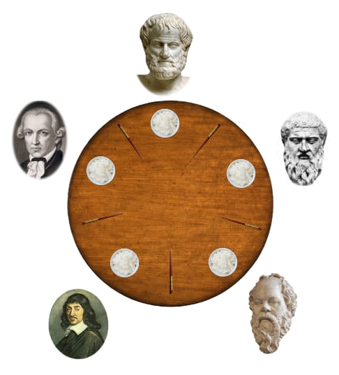

# Dining Philosphers problem

 

<h3>What I learned :heavy_check_mark:  </h3> 
<li>Parallelism.</li>
<li>Never had I developed multithreaded programs before this project.</li>
<li>It gave me the opportunity to learn about threads, mutex and semaphores.</li>
const { Client } = require("@notionhq/client");
const { NotionToMarkdown } = require("notion-to-md");
// or
// import {NotionToMarkdown} from "notion-to-md";

const notion = new Client({
  auth: "your integration token",
});

// passing notion client as
const n2m = new NotionToMarkdown({ notionClient: notion });

(async () => {
  const mdblocks = await n2m.pageToMarkdown("target_page_id");
  const mdString = n2m.toMarkdownString(mdblocks);

  //writing to file
  fs.writeFile("test.md", mdString, (err) => {
    console.log(err);
  });
})();
